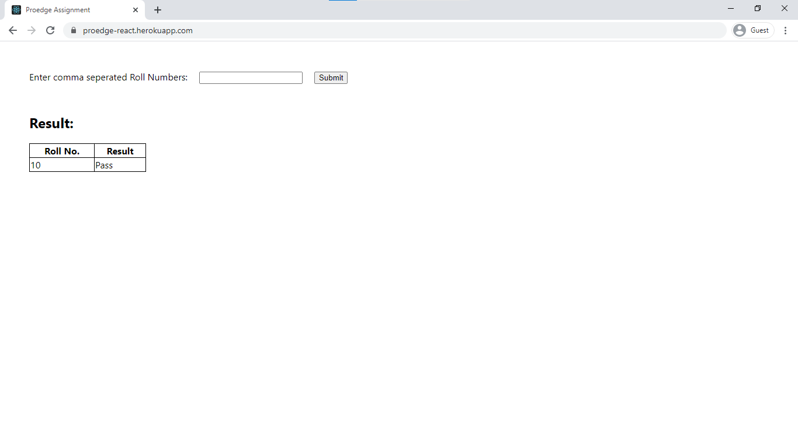
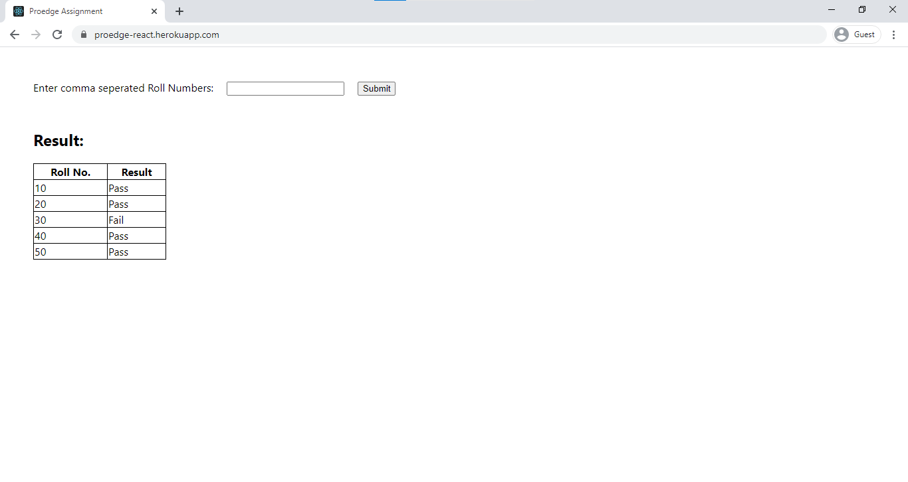
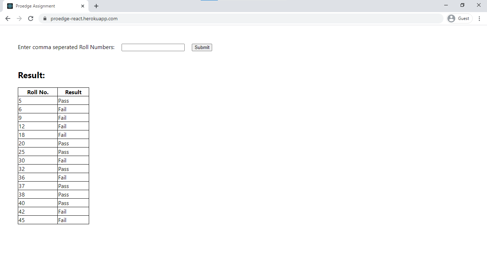

# Proedge ReactJS Assignment: 
https://proedge-react.herokuapp.com/

Assignment 2: 
To shorten a string and expand it back

Algorithm for shortening: 
1. Assign numbers from (1 to 26) to (a to z) respectively. 
2. Convert each number to its binary equivalent of 5-bits (because 2^5 > 26).  
3. Concatenate all the binary into a single string. 
4. Now take 6 bits at a time and convert it into its decimal equivalent (6 bits because 2^6 = 64 i.e. using only 64 characters from ASCII table to avoid unnecessary character like null, space etc.) 
5. Add 58 to each decimal value to avoid first 58 characters of ASCII table. 
6. Convert each decimal value to its character equivalent and concatenate into a single string to obtain the compressed data. 

Assignment 1:
To make an API call and display it in a table

Project Structure: 
index.js 
&nbsp;&nbsp;&nbsp;&nbsp;-src/App.js 
&nbsp;&nbsp;&nbsp;&nbsp;&nbsp;&nbsp;&nbsp;&nbsp;- components/Main.js 
      

Test Cases: 
1. 10 

2. 10,20,30,40,50

3. 5,6,9,12,18,20,25,30,32,36,37,38,40,42,45

